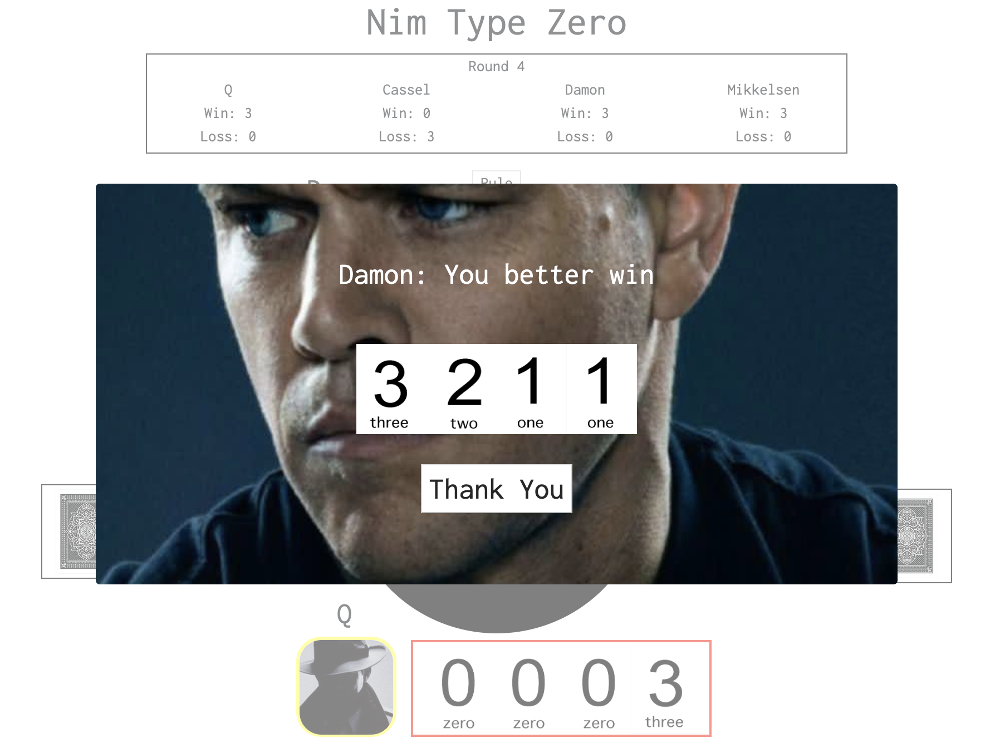

# Nim Type Zero


## Motivation

This project carries an ambition to integrate a card game with the computer player AI algorithm that plays specific roles according to the story. This game, therefore, includes the storyboard, secretive computer behaviors and hidden features that the player needs to find to win the game.

The game, "Nim Type Zero," is from the Japanese animation called "Kakegurui," and the storyline is inspired by the film, "007: Casino Royale."

## Intro

### Getting Started

[Play Nim Type Zero](https://benoh0906.github.io/project1_nim_type_zero/.)

### Rule

1. The game is played with a deck of 40 cards, labeled with numbers 0, 1, 2, 3.
2. The deck is shuffled using Gilbreath Shuffle 
3. Four cards are dealt to each player.
4. The game starts with each player having four cards in their hand not revealed to their opponents.
5. The players play eight rounds, and the starting player changes every turn
6. At a player's turn, one must play a card from their hand by declaring its number and placing it down on the table.
7. The card's value is added to the total value.
8. If the player adds the card that makes the total value exceeding 9, the player loses the round.

### Story

- The player's goal is to prevent the evil mafia bosses from earning the prize money from the gambling tournament
- The player is called Agent Q, playing against three mafia family bosses called Cassel, Damon, and Mikkelsen
- The game that the gamblers will play is called Nim Type Zero, which the player has to win in order to stop the evil mafia bosses
- The player's mission is to win the competition in order to prevent mafia families from expanding their business


### Built With

- HTML5
- CSS3
- JavaScript
- JQuery


## Wireframe

### Tutorials

Opening


- ">>": leads to the next page.
- "skip": skips the story and tutorial and goes straight to the 'start' page.

Mission


- Description of the story of the game.
- ">>": leads to the next page.
- "<<": leads to the previous page.

Rule


- Description of the rule of the game.

Start


- Start: starts the real game
- Can access to this modal through the 'skip' button on the opening page.

### Game


Scoreboard

- Displays the number of wins and losses for all players
- Displays the current round

Rule Button

- When the player clicks the button, the rule modal shows up again
- By clicking the close button, the player can close the rule modal

Table

- The black circle at the center of the page updates and shows the cumulative value of the cards 

Player Profile

- The profile of "Q" at the bottom of the page represents the player
- By clicking any card image of Q, the player can play the card to the table
- While other players play the card, the player cannot click the card image by blocking the card section with a box of div
	
## Notable Features

**Gilbreath shuffle**

It is a way to shuffle decks that ensures that with a deck of 4 different suits, every four cards will always feature all suits.

Since the suits in this game are instead the values 0, 1, 2, 3 in simple terms it means that in every game there are a total of four of each number, redistributed randomly. 

With the feature, the player can estimate what cards other players have on their hands.

**Computer play AI**

Three computer players (Cassel, Damon, and Mikkelson) plays by the algorithm that determines what card they have to play in order for them to win the game and attack the next player.

The function accepts the list of cards on hand as the parameters. Then, it adds the value of the card on their hand to the current total value, and categorize them as winning or losing card array.

The computer player then submits the highest value card from the winning category to make the next players lose before their turn comes back.

**Conspire AI**

However, Cassel is made in a way that helps Mikkelson to win. He will not play the card that can potentially lead Mikkelson to lose. 

```
function conspireAI(index){
    if (index===1){
        const p4WinHigh=[]
        const p4WinMid=[]
        const p4WinLow=[]
        const p4Lose=[]

        for(let i = 0; i < game.players[index].hand.length;i++){
            const usedOrNotCons1=document.querySelector(`#p${index+1}Card`).childNodes[i].src

            if(usedOrNotCons1 ==="file:///Users/jungbinoh/sei-autumn-sweaters/nim_type_zero/css/img/card/back.jpg"){
                if (game.players[index].hand[i]+3+game.cumulative < 10){
                    p4WinHigh.push([game.players[index].hand[i],i])

                } else if (game.players[index].hand[i]+2+game.cumulative < 10) {

                    p4WinMid.push([game.players[index].hand[i],i])

                } else if(game.players[index].hand[i]+1+game.cumulative < 10){
                    p4WinLow.push([game.players[index].hand[i],i])
                } else {
                    p4Lose.push([game.players[index].hand[i],i])
                }
        
            }
        }

        if(p4WinHigh.length>=1){
            return p4WinHigh[0][1]
        } else if (p4WinMid.length>=1){
            return p4WinMid[0][1]
        } else if (p4WinLow.length>=1){
            return p4WinLow[0][1]
        } else {
            return p4Lose[0][1]
        }

    }
}
```


He does so by categorizing his cards into the level of danger that can be posed to Mikkelson. He chooses the card that can threaten Mikkelson the least, and even loses the game on purpose to protect Mikkelson.


**Hidden help**


The player can ask for help from Damon.

When the player clicks the profile picture of Damon, the modal shows up.




If the player types in the secret code 'sos' into the input and clicks the submit button, Damon displays all the cards he holds on his hand.

The player must find seceret of Gilbreath Shuffle and get help from Damon to win the game against Cassel and Mikkelsen's secret alliance.


